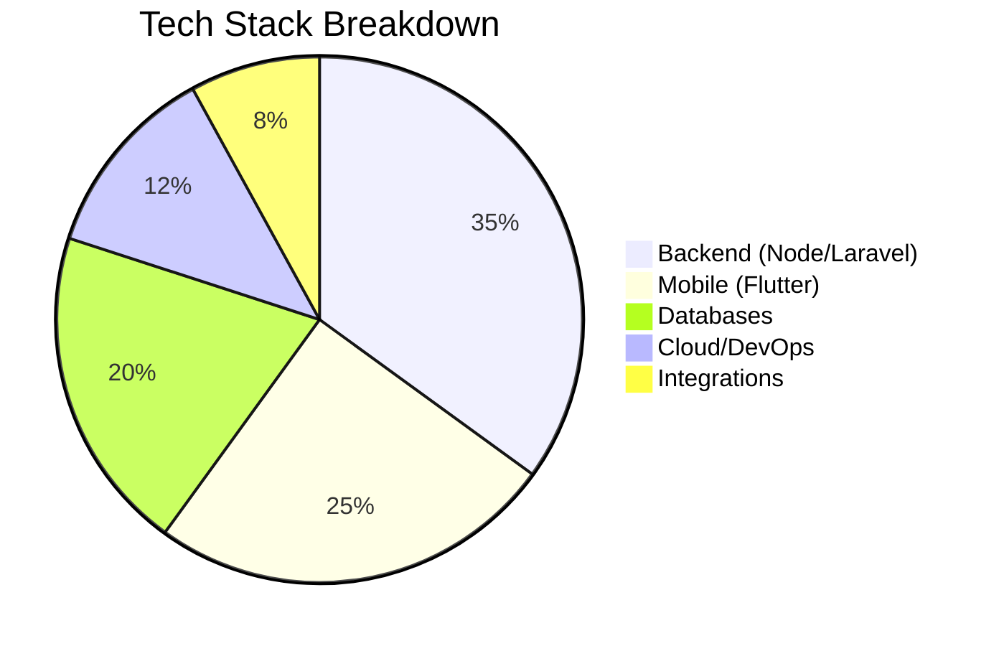
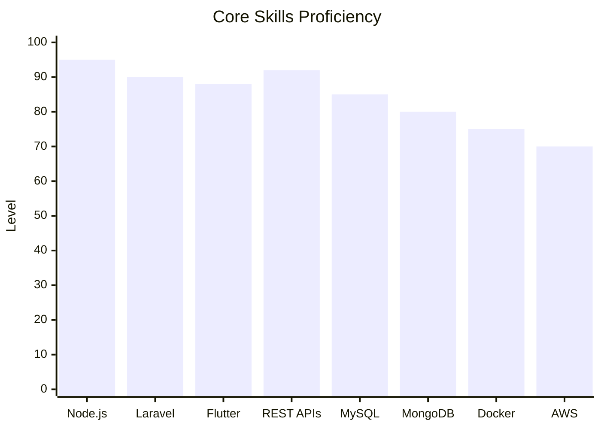
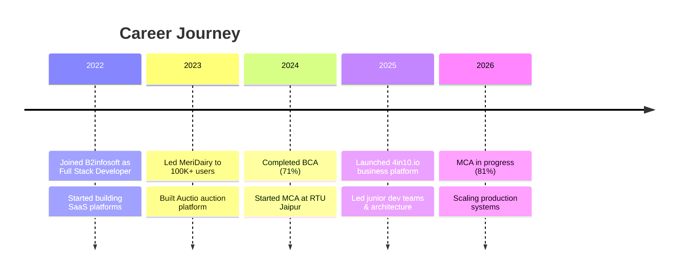
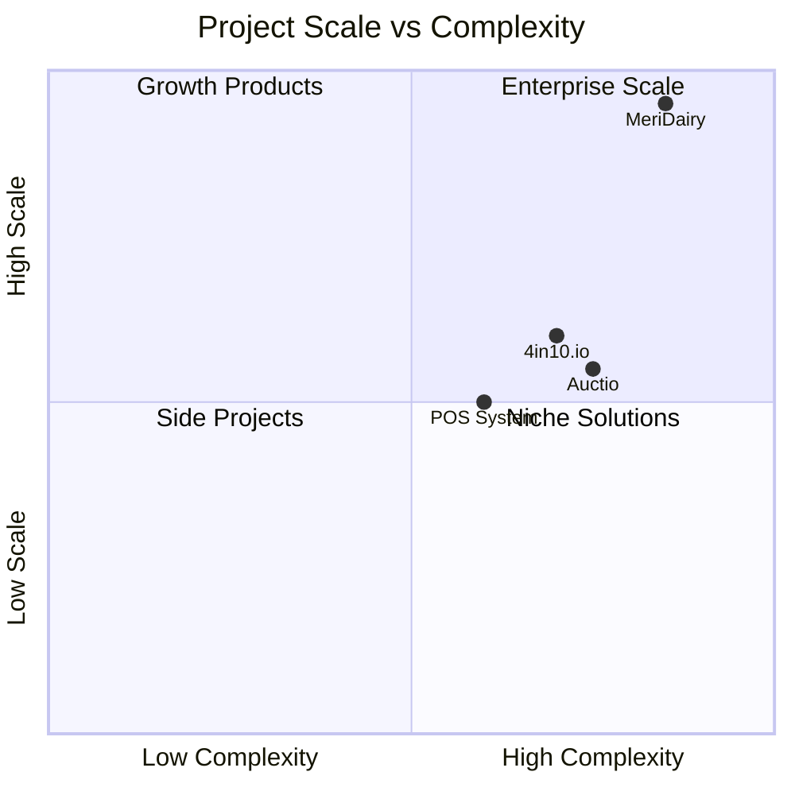
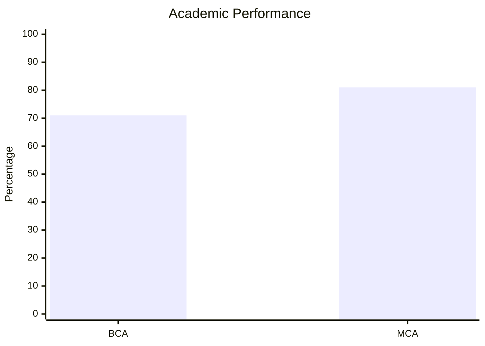
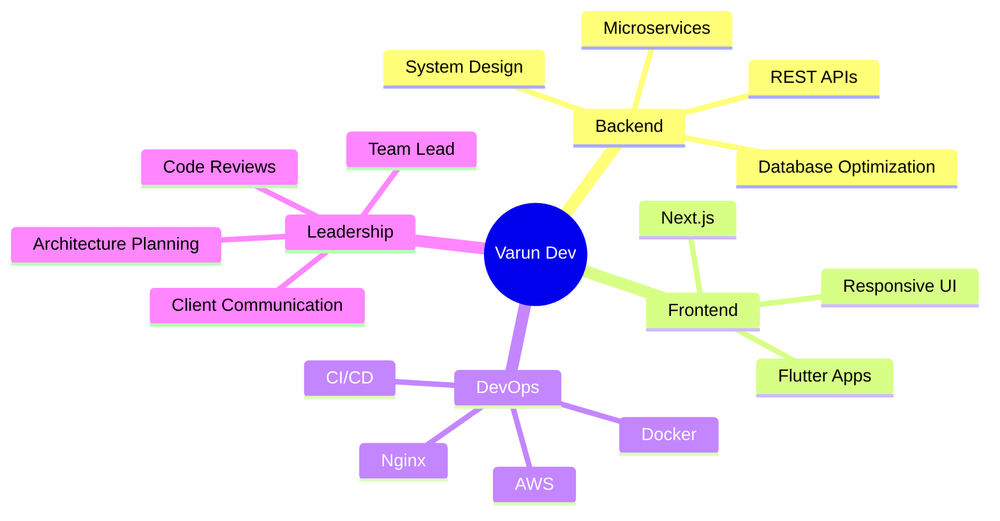

<div align="center">

<!-- Animated Header Banner -->


<!-- Typing Animation -->
<a href="https://git.io/typing-svg">
  
</a>

<br/>

<!-- Profile Views Counter -->


<br/><br/>

[](mailto:varun211331@gmail.com)
[](https://linkedin.com/in/varun-dev-26821a337)
[](https://github.com/varun-b2infosoft)
[](https://meridairy.in)

</div>

---

## 👨‍💻 About Me

```javascript
const varun = {
  name: "Varun Dev",
  location: "Jaipur, Rajasthan, India 📍",
  role: "Full Stack Developer @ B2infosoft",
  experience: "3+ years",
  focus: ["Scalable Backend Systems", "SaaS Applications", "Mobile Apps"],
  currentlyLearning: ["System Design", "Microservices", "AWS"],
  funFact: "Built platforms serving 100K+ dairy farmers 🐄"
};
```

> **Full Stack Developer** with **3+ years** of experience building scalable backend systems and SaaS applications. I specialize in **Node.js**, **Express.js**, **REST APIs**, and **microservices** — with hands-on experience in **Flutter**, **Laravel**, **MongoDB**, **PostgreSQL**, **Docker**, and **AWS**. Passionate about system architecture, API development, database optimization, and delivering production-grade applications.

---

## 📊 GitHub Analytics Dashboard

<div align="center">

<!-- GitHub Stats -->


<br/>

<!-- Top Languages -->


</div>

### 📈 Contribution Activity Graph

<div align="center">
  
</div>

### 🏆 GitHub Trophies

<div align="center">
  
</div>

### 📉 Profile Summary Cards

<div align="center">
  
  
  
  
  
</div>

---

## 🛠️ Tech Stack

### Backend & APIs


### Frontend & Mobile


### Databases


### Cloud & DevOps


### Integrations & APIs


### 📊 Skills Distribution



### 📊 Skill Proficiency



---

## 💼 Professional Experience



### Full Stack Developer — **B2infosoft** `Jul 2022 – Present`

| Responsibility | Details |
|:---|:---|
| 🏗️ **Architecture** | Designed scalable REST APIs & database architectures |
| 📱 **Development** | Built SaaS platforms & Flutter mobile applications |
| 👥 **Leadership** | Led junior developers, code reviews & tech planning |
| 🚀 **DevOps** | Managed deployments, backend optimization & live fixes |
| 🤝 **Client Work** | Direct client collaboration for requirements & delivery |

---

## 🚀 Featured Projects

<table>
<tr>
<td width="50%" valign="top">

### 🥛 [MeriDairy](https://meridairy.in) — `100K+ Users`

[](https://meridairy.in)

> Complete dairy management SaaS platform for milk collection, billing & operations.

**Stack:** `Laravel` `Flutter` `MySQL` `REST APIs`

**Features:**
- 🥛 Milk entry & collection workflows
- 💰 Billing, invoicing & payment systems
- 👥 Customer & vendor management
- 📊 Operational dashboards & reports
- 📱 Cross-platform Flutter mobile app

</td>
<td width="50%" valign="top">

### 📋 [4in10.io](https://4in10.io)

[](https://4in10.io)

> Business planning, goal tracking & strategy execution platform.

**Stack:** `Laravel` `PostgreSQL`

**Features:**
- 🎯 Goal tracking & KPI dashboards
- 📈 Business planning workflows
- 🌐 CMS & website builder
- 👥 Collaborative team management
- 📊 Strategy execution tools

</td>
</tr>
<tr>
<td width="50%" valign="top">

### 🔨 Auctio — Online Auction Platform

**Stack:** `Flutter` `Node.js` `MySQL`

**Features:**
- 🏷️ Real-time bidding system
- 📦 Product listing management
- 👤 Seller-user interactions
- 💳 Transaction workflows
- 📱 Flutter mobile application

</td>
<td width="50%" valign="top">

### 🏪 POS Management System

**Stack:** `Flutter` `Node.js` `MySQL`

**Features:**
- 📦 Inventory management
- 💰 Sales & purchase tracking
- 👥 Customer management
- 📊 Day-to-day business operations
- 📱 Mobile POS workflows

</td>
</tr>
</table>

### 📊 Project Impact Overview



---

## 🎓 Education

| Degree | Institution | Duration | Score |
|:---|:---|:---:|:---:|
| **MCA** — Master of Computer Applications | Rajasthan Technical University (RTU), Jaipur | 2024 – 2026 | **81%** |
| **BCA** — Bachelor of Computer Applications | Rajasthan University, Jaipur | 2022 – 2024 | **71%** |



---

## 🧠 Core Competencies



| Skill Area | Expertise |
|:---|:---:|
| System Design & Architecture | ██████████ 95% |
| API Development | ██████████ 92% |
| Database Optimization | █████████░ 88% |
| Flutter / Mobile Dev | █████████░ 88% |
| Production Debugging | █████████░ 85% |
| Team Leadership | ████████░░ 80% |

---

## 🎮 Fun Zone — Play While You Browse!

<div align="center">

### 🐍 Contribution Snake Game


### 🌙 Snake — Dark Mode


### 📈 Contribution Chart


<br/>

<!-- Random Dev Joke -->


<br/>

<!-- Random Dev Quote -->


</div>

---

## 📫 Let's Connect!

<div align="center">

| 📧 Email | 📱 Phone | 💼 LinkedIn | 🐙 GitHub |
|:---:|:---:|:---:|:---:|
| [varun211331@gmail.com](mailto:varun211331@gmail.com) | +91 8209442958 | [varun-dev](https://linkedin.com/in/varun-dev-26821a337) | [varun-b2infosoft](https://github.com/varun-b2infosoft) |

<br/>

<!-- Spotify Now Playing (optional - shows if connected) -->
<!--  -->


<br/>

[](https://visitcount.itsvg.in)

</div>

<!-- Proudly crafted with ❤️ by Varun Dev -->
